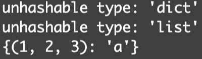

[Python Glossary](https://docs.python.org/3.1/glossary.html) 에서는 hashable 에 대해서 아래와 같이 정의한다.

```
An object is hashable if it has a hash value which never changes during its lifetime (it needs a __hash__() method), and can be compared to other objects (it needs an __eq__() method). Hashable objects which compare equal must have the same hash value.
```

즉, 어떤 객체가 아래의 두 조건을 만족하면 해시 가능 객체 (hashable object) 라고 한다.

- 해당 객체의 해시 값이 변하지 않음. ('**hash**() 메소드가 필요함.')
- 다른 객체와의 비교가 가능함. ('**eq**() 메소드가 필요함.')

파이썬의 내장 객체 중에서 변경 불가능(immutable) 객체는 모두 해시 가능(hashable) 하다 (예: 일반적인 자료형, 튜플). 또한, 사용자 정의 클래스는 기본적으로 hashable 하다. 즉, 사용자 정의 클래스를 통해 생성된 인스턴스의 해시 값은 변하지 않으며, 인스턴스끼리 비교가 가능하다는 것이다. 반면에, 변경 가능(mutable) 객체는 해시 불가능하다 (예: 리스트, 딕셔너리).

해시 가능(hashable) 에 대한 개념을 알고 있다면, 어떠한 객체를 딕셔너리의 키(key)로 사용 할 수 없는 지 알 수 있다. 파이썬의 딕셔너리의 키(key)는 해시 가능한 객체만 사용 할 수 있는데, 그 이유는 딕셔너리가 내부적으로 맵핑을 할 때에 해시 값을 사용하기 때문이다.

따라서, 변경 가능(mutable) 객체인 리스트와 딕셔너리는 다른 딕셔너리의 키로 사용 할 수 없다. 아래의 코드는 딕셔너리, 리스트, 튜플을 다른 딕셔너리의 키로 사용 했을 때의 결과이다.

```python
dict_for_key = {1: 'a', 2: 'b', 3: 'c'},
list_for_key = [1, 2, 3],
tuple_for_key = (1, 2, 3)

keys = [dict_for_key, list_for_key, tuple_for_key]

for k in keys:
    try:
        sample_dict = {k: 'a'}
        print(sample_dict)
    except Exception as ex:
        print(ex)
```



딕셔너리와 리스트를 다른 딕셔너리의 키로 사용하려 할 경우 TypeError: unhashable type 과 같은 에러 메세지가 뜨는 것을 확인 할 수 있다. 반면에 튜플의 경우 해시 가능한 객체이기 때문에 키 값으로 사용 할 수 있음을 확인 할 수 있다.
